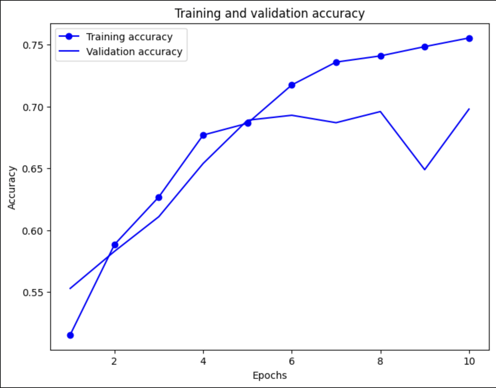
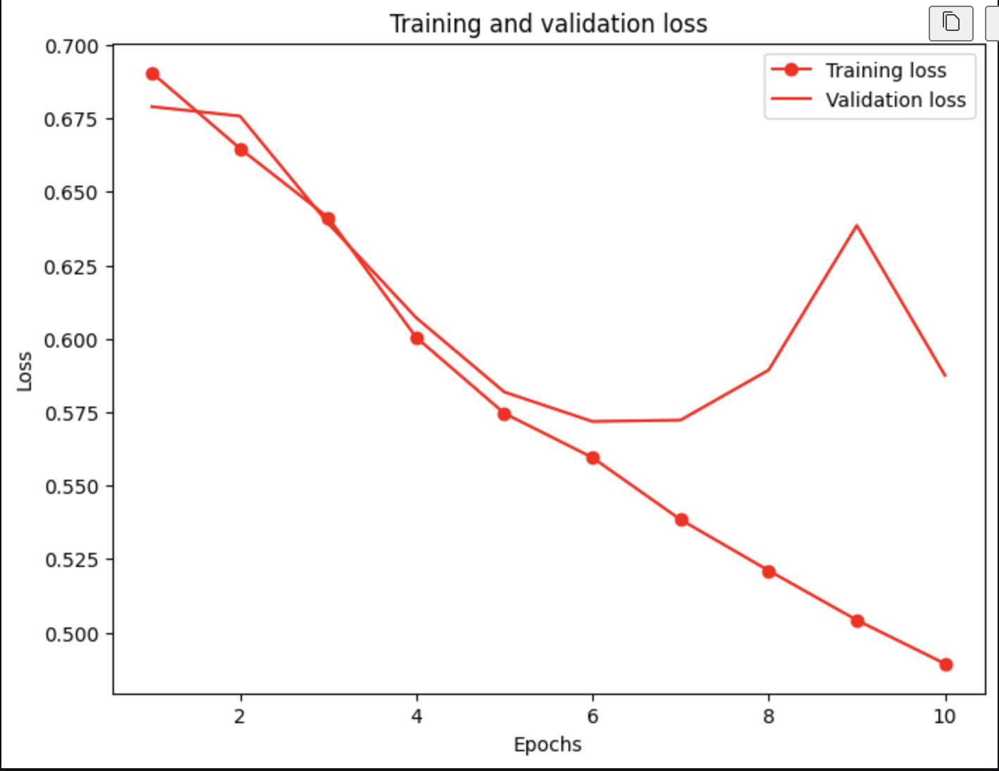
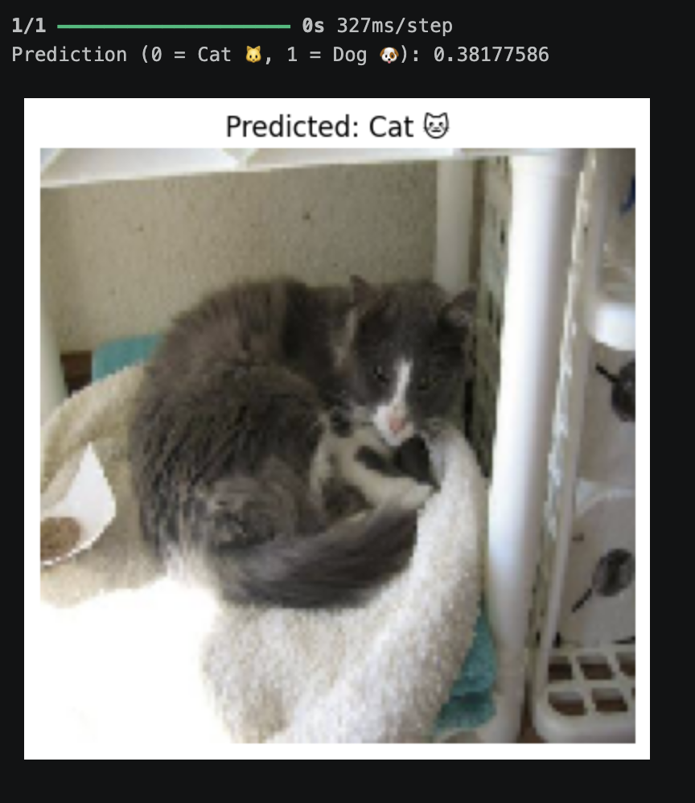

# Cats vs Dogs Image Classification using CNN

A deep learning-based image classification project that uses Convolutional Neural Networks (CNNs) to classify images of cats and dogs. Built using PyTorch with image preprocessing, augmentation, model training, and evaluation pipelines.

---

## Features

- Image classification using CNN
- Data preprocessing and normalization
- Image augmentation techniques
- Model training and evaluation
- Accuracy and loss visualization
- PyTorch-based implementation

---

## Tech Stack

- Python
- PyTorch
- NumPy
- Matplotlib
- Jupyter Notebook

---

## Dataset

The project uses a Cats vs Dogs image dataset containing labeled images for binary image classification.

---

## Model Workflow

1. Load and preprocess image dataset
2. Apply transformations and normalization
3. Build CNN architecture
4. Train model using PyTorch
5. Evaluate accuracy and performance
6. Visualize training metrics

---

## Project Structure

```bash
cats-dogs-cnn/
│
├── cats_dogs_cnn.ipynb
├── README.md
├── requirements.txt
├── .gitignore
│
└── sample_outputs/
    ├── training_accuracy.png
    ├── training_loss.png
    └── prediction_sample.png
```

---

## Installation

Clone the repository:

```bash
git clone https://github.com/karansingh012/cats-dogs-cnn.git
```

Move into project directory:

```bash
cd cats-dogs-cnn
```

Install dependencies:

```bash
pip install -r requirements.txt
```

Run Jupyter Notebook:

```bash
jupyter notebook
```

---

## Sample Outputs

### Training and Validation Accuracy



### Training and Validation Loss



### Prediction Example



---

## Results

- Successfully classified cat and dog images using CNN
- Achieved consistent improvement in training accuracy across epochs
- Applied preprocessing and augmentation techniques to improve model performance
- Evaluated model performance using validation accuracy and loss metrics

---

## Future Improvements

- Transfer learning using ResNet or EfficientNet
- Hyperparameter tuning
- Model deployment using Flask or FastAPI
- Real-time image prediction interface

---

## Author

Karan Singh

- GitHub: https://github.com/karansingh012
- LinkedIn: https://linkedin.com/in/karansing